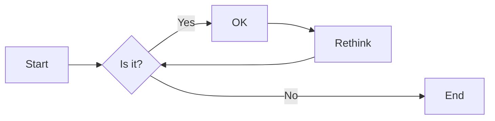
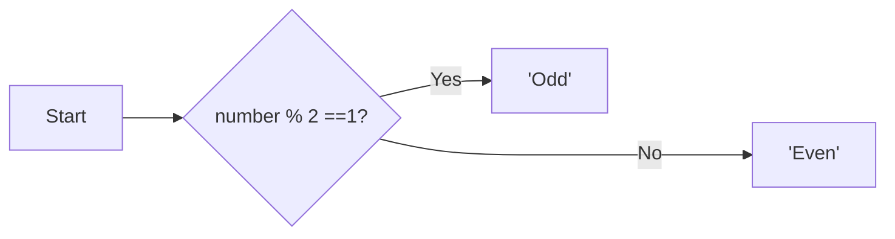

# 实验二 Python变量、简单数据类型

班级： 21计科1班

学号： B20210302129

姓名： 吴俊君

Github地址：<https://github.com/TYRandall/course>

CodeWars地址：<https://www.codewars.com/users/Ethereal__>

---

## 实验目的

1. 使用VSCode编写和运行Python程序
2. 学习Python变量和简单数据类型

## 实验环境

1. Git
2. Python 3.10
3. VSCode
4. VSCode插件

## 实验内容和步骤

### 第一部分

实验环境的安装

1. 安装Python，从Python官网下载Python 3.10安装包，下载后直接点击可以安装：[Python官网地址](https://www.python.org/downloads/)
2. 为了在VSCode集成环境下编写和运行Python程序，安装下列VScode插件
   - Python
   - Python Environment Manager
   - Python Indent
   - Python Extended
   - Python Docstring Generator
   - Jupyter
   - indent-rainbow
   - Jinja

---

### 第二部分

Python变量、简单数据类型和列表简介

完成教材《Python编程从入门到实践》下列章节的练习：

- 第2章 变量和简单数据类型

---

### 第三部分

在[Codewars网站](https://www.codewars.com)注册账号，完成下列Kata挑战：

---

#### 第1题：求离整数n最近的平方数（Find Nearest square number）

难度：8kyu

你的任务是找到一个正整数n的最近的平方数
例如，如果n=111，那么nearest_sq(n)（nearestSq(n)）等于121，因为111比100（10的平方）更接近121（11的平方）。
如果n已经是完全平方（例如n=144，n=81，等等），你需要直接返回n。
代码提交地址
<https://www.codewars.com/kata/5a805d8cafa10f8b930005ba>

---

#### 第2题：弹跳的球（Bouncing Balls）

难度：6kyu

一个孩子在一栋高楼的第N层玩球。这层楼离地面的高度h是已知的。他把球从窗口扔出去。球弹了起来,  例如:弹到其高度的三分之二（弹力为0.66）。他的母亲从离地面w米的窗户向外看,母亲会看到球在她的窗前经过多少次（包括球下落和反弹的时候）？

一个有效的实验必须满足三个条件：

- 参数 "h"（米）必须大于0
- 参数 "bounce "必须大于0且小于1
- 参数 “window "必须小于h。

如果以上三个条件都满足，返回一个正整数，否则返回-1。
**注意:只有当反弹球的高度严格大于窗口参数时，才能看到球。**
代码提交地址
<https://www.codewars.com/kata/5544c7a5cb454edb3c000047/train/python>

---

#### 第3题： 元音统计(Vowel Count)

难度： 7kyu

返回给定字符串中元音的数量（计数）。对于这个Kata，我们将考虑a、e、i、o、u作为元音（但不包括y）。输入的字符串将只由小写字母和/或空格组成。

代码提交地址：
<https://www.codewars.com/kata/54ff3102c1bad923760001f3>

---

#### 第4题：偶数或者奇数（Even or Odd）

难度：8kyu

创建一个函数接收一个整数作为参数，当整数为偶数时返回”Even”当整数位奇数时返回”Odd”。
代码提交地址：
<https://www.codewars.com/kata/53da3dbb4a5168369a0000fe>

### 第四部分

使用Mermaid绘制程序流程图

安装Mermaid的VSCode插件：

- Markdown Preview Mermaid Support
- Mermaid Markdown Syntax Highlighting

使用Markdown语法绘制你的程序绘制程序流程图（至少一个），Markdown代码如下：


显示效果如下：



查看Mermaid流程图语法-->[点击这里](https://mermaid.js.org/syntax/flowchart.html)

使用Markdown编辑器（例如VScode）编写本次实验的实验报告，包括[实验过程与结果](#实验过程与结果)、[实验考查](#实验考查)和[实验总结](#实验总结)，并将其导出为 **PDF格式** 来提交。

## 实验过程与结果

### 第二部分 Python变量、简单数据类型和列表简介

#### 练习 2.1

Code：

```python
message="Hello World!"
print(message)
```

Output：

```python
Hello World!
```

#### 练习 2.2

Code：

```python
message="Hello World!"
print(message)
message="Hello Python!"
print(message)
```

Output：

```python
Hello World!
Hello Python!
```

#### 练习 2.3

Code：

```python
name="Eric"
print(f'Hello {name},would you like to learn some Python today?')
```

Output：

```python
Hello Eric,would you like to learn some Python today?
```

#### 练习 2.4

Code：

```python
name="Ethereal"
print(f'{name.lower()}\n{name.upper()}\n{name.title()}')
```

Output：

```python
ethereal
ETHEREAL
Ethereal
```

#### 练习 2.5

Code：

```python
print('Albert Einstein once said,\"A person who never made a mistake never tried anything new.\"')
```

Output：

```python
Albert Einstein once said,"A person who never made a mistake never tried anything new."
```

#### 练习 2.6

Code：

```python
famous_person='Albert Einstein'
message=f'{famous_person} once said,\"A person who never made a mistake never tried anything new.\"'
print(message)
```

Output：

```python
Albert Einstein once said,"A person who never made a mistake never tried anything new."
```

#### 练习 2.7

Code：

```python
famous_person='\n\t Albert Einstein  \n'
print(famous_person)
print(f'{famous_person.lstrip()}')
print(f'{famous_person.rstrip()}')
print(f'{famous_person.strip()}')
```

Output：

```python

         Albert Einstein

Albert Einstein


         Albert Einstein
Albert Einstein
```

#### 练习 2.8

Code：

```python
filename='python_notes.txt'
print(filename.removesuffix('.txt'))
```

Output：

```python
python_notes
```

#### 练习 2.9

Code：

```python
print(5+3)
print(10-2)
print(2*4)
print(16//2)
```

Output：

```python
8
8
8
8
```

#### 练习 2.10

Code：

```python
number=114514
message="My favorite number is " + str(number) + '.'
print(message)
```

Output：

```python
My favorite number is 114514.
```

#### 练习 2.11

Code：

```python
#喜欢的数字
number=114514
#打印消息
message="My favorite number is " + str(number) + '.'
print(message)
```

Output：

```python
My favorite number is 114514.
```

### 第三部分 Codewars Kata挑战

#### 第1题：[求离整数n最近的平方数（Find Nearest square number）](<https://www.codewars.com/kata/5a805d8cafa10f8b930005ba>)

Code：

```python
def nearest_sq(n):
    temp=n**0.5
    if abs((temp//1)**2-n)>abs((temp//1+1)**2-n):
        return (temp//1+1)**2
    elif abs((temp//1)**2-n)<abs((temp//1+1)**2-n):
        return (temp//1)**2
    else:
        return n;
```

#### 第2题：[弹跳的球（Bouncing Balls）](https://www.codewars.com/kata/5544c7a5cb454edb3c000047/train/python)

Code：

```python
def bouncing_ball(h, bounce, window):
    if h<=0 or bounce <=0 or bounce >=1 or window >=h: 
        return -1
    ans=1
    while True:
        h=h*bounce
        if h<=window:
            break
        else:
            ans+=2
    return ans
```

#### 第3题：[元音统计(Vowel Count)](https://www.codewars.com/kata/54ff3102c1bad923760001f3)

Code：

```python
def get_count(sentence):
    ans=0
    for value in sentence:
        if value=='a' or value=='e' or value=='i' or value=='o' or value=='u':
            ans+=1
    return ans
```

#### 第4题：[偶数或者奇数（Even or Odd）](https://www.codewars.com/kata/53da3dbb4a5168369a0000fe)

Code：

```python
def even_or_odd(number):
    if number % 2 ==1:
        return "Odd"
    else:
        return "Even"
```

### 第四部分 使用Mermaid绘制程序流程图

偶数或者奇数（Even or Odd）

Code：

```python
def even_or_odd(number):
    if number % 2 ==1:
        return "Odd"
    else:
        return "Even"
```

流程图：



## 实验考查

请使用自己的语言并使用尽量简短代码示例回答下面的问题，这些问题将在实验检查时用于提问和答辩以及实际的操作。

1. Python中的简单数据类型有那些？我们可以对这些数据类型做哪些操作？
    - 整型：可以进行加减乘除、取余、幂运算等。
    - 浮点型：除了整型的操作外，还可以进行四舍五入、向上取整、向下取整等。
    - 复数：可以进行加减乘除等运算。
    - 布尔型：可以进行逻辑运算如与、或、非等。
2. 为什么说Python中的变量都是标签？
   在Python中，我们定义变量时，实际上是在给对象“贴上”一个标签，这个标签可以指向各种类型的对象，如整数、浮点数、字符串、列表等。当我们改变这个标签指向的对象时，所有引用这个标签的地方都会反映出这个变化。
   ```python
    a=10 #a 就变成了指向整数10的一个标签
    a='Hello' #a 现在指向了新的对象
   ```
3. 有哪些方法可以提高Python代码的可读性？
    - 遵循PEP 8风格指南
    - 使用有意义的变量名和函数名
    - 使用注释
    - 保持函数和类的简洁
    - 避免使用复杂的表达式
    - 使用空格和空行来分隔代码块
    - 避免使用全局变量
    - 使用类型提示
    - 编写文档字符串
    - 测试你的代码

## 实验总结

通过此次实验，我学习了有关Python的变量的使用，明白了在Python中变量与其他编程语言的不同。了解了简单的数据类型，如整数、浮点值、布尔值、复数。也学会了字符串的各种用法，将字符串通过一些常用的方法达成自己的目的，例如title()，是将字符串中每个单词首字母大写。还学会了如何利用Markdown编写流程图。另外再通过几道算法题能够更加深入的巩固了此次学习的知识，为后续的课程学习打下基础。