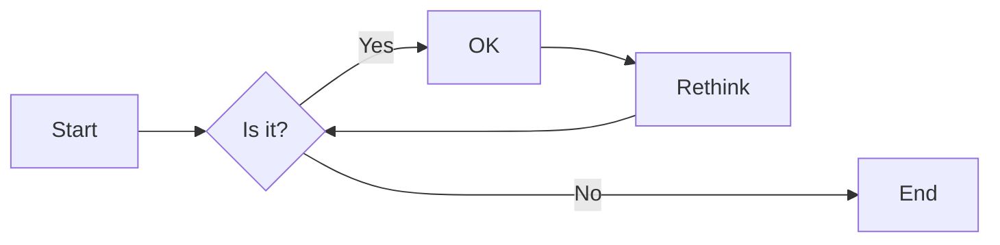
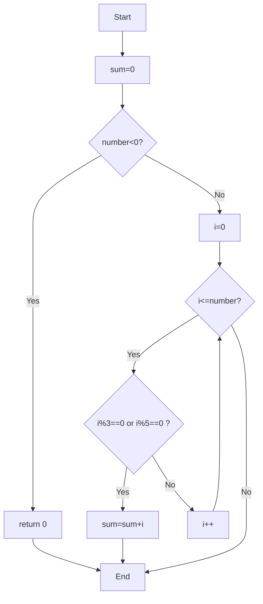

# 实验三 Python列表

班级： 21计科1

学号： B20210302129

姓名： 吴俊君

Github地址：<https://github.com/TYRandall/course>

CodeWars地址：<https://www.codewars.com/users/Ethereal__>

---

## 实验目的

1. 学习Python的简单使用和列表操作
2. 学习Python中的if语句

## 实验环境

1. Git
2. Python 3.10
3. VSCode
4. VSCode插件

## 实验内容和步骤

### 第一部分

Python列表操作

完成教材《Python编程从入门到实践》下列章节的练习：

- 第3章 列表简介
- 第4章 操作列表
- 第5章 if语句

---

### 第二部分

在[Codewars网站](https://www.codewars.com)注册账号，完成下列Kata挑战：

---

#### 第一题：3和5的倍数（Multiples of 3 or 5）

难度： 6kyu

如果我们列出所有低于 10 的 3 或 5 倍数的自然数，我们得到 3、5、6 和 9。这些数的总和为 23. 完成一个函数，使其返回小于某个整数的所有是3 或 5 的倍数的数的总和。此外，如果数字为负数，则返回 0。

注意：如果一个数同时是3和5的倍数，应该只被算一次。

**提示：首先使用列表解析得到一个列表，元素全部是3或者5的倍数。
使用sum函数可以获取这个列表所有元素的和.**

代码提交地址：
<https://www.codewars.com/kata/514b92a657cdc65150000006>

---

#### 第二题： 重复字符的编码器（Duplicate Encoder）

难度： 6kyu

本练习的目的是将一个字符串转换为一个新的字符串，如果新字符串中的每个字符在原字符串中只出现一次，则为"("，如果该字符在原字符串中出现多次，则为")"。在判断一个字符是否是重复的时候，请忽略大写字母。

例如:

```python
"din"      =>  "((("
"recede"   =>  "()()()"
"Success"  =>  ")())())"
"(( @"     =>  "))(("
```

代码提交地址:
<https://www.codewars.com/kata/54b42f9314d9229fd6000d9c>

---

#### 第三题：括号匹配（Valid Braces）

难度：6kyu

写一个函数，接收一串括号，并确定括号的顺序是否有效。如果字符串是有效的，它应该返回True，如果是无效的，它应该返回False。
例如：

```python
"(){}[]" => True 
"([{}])" => True
 "(}" => False
 "[(])" => False 
"[({})](]" => False
```

**提示：
python中没有内置堆栈数据结构，可以直接使用`list`来作为堆栈，其中`append`方法用于入栈，`pop`方法可以出栈。**

代码提交地址
<https://www.codewars.com/kata/5277c8a221e209d3f6000b56>

---

#### 第四题： 从随机三元组中恢复秘密字符串(Recover a secret string from random triplets)

难度： 4kyu

有一个不为你所知的秘密字符串。给出一个随机三个字母的组合的集合，恢复原来的字符串。

这里的三个字母的组合被定义为三个字母的序列，每个字母在给定的字符串中出现在下一个字母之前。"whi "是字符串 "whatisup "的一个三个字母的组合。

作为一种简化，你可以假设没有一个字母在秘密字符串中出现超过一次。

对于给你的三个字母的组合，除了它们是有效的三个字母的组合以及它们包含足够的信息来推导出原始字符串之外，你可以不做任何假设。特别是，这意味着秘密字符串永远不会包含不出现在给你的三个字母的组合中的字母。

测试用例：

```python
secret = "whatisup"
triplets = [
  ['t','u','p'],
  ['w','h','i'],
  ['t','s','u'],
  ['a','t','s'],
  ['h','a','p'],
  ['t','i','s'],
  ['w','h','s']
]
test.assert_equals(recoverSecret(triplets), secret)
```

代码提交地址：
<https://www.codewars.com/kata/53f40dff5f9d31b813000774/train/python>

提示：

- 利用集合去掉`triplets`中的重复字母，得到字母集合`letters`，最后的`secret`应该由集合中的字母组成，`secret`长度也等于该集合。

```python
letters = {letter for triplet in triplets for letter in triplet }
length = len(letters)
```

- 创建函数`check_first_letter(triplets, first_letter)`，检测一个字母是不是secret的首字母，返回True或者False。
- 创建函数`remove_first_letter(triplets, first_letter)`,  从三元组中去掉首字母，返回新的三元组。
- 遍历字母集合letters，利用上面2个函数得到最后的结果`secret`。

---

#### 第五题： 去掉喷子的元音（Disemvowel Trolls）

难度： 7kyu

喷子正在攻击你的评论区!
处理这种情况的一个常见方法是删除喷子评论中的所有元音(字母：a,e,i,o,u)，以消除威胁。
你的任务是写一个函数，接收一个字符串并返回一个去除所有元音的新字符串。
例如，字符串 "This website is for losers LOL!"   将变成 "Ths wbst s fr lsrs LL!".

注意：对于这个Kata来说，y不被认为是元音。
代码提交地址：
<https://www.codewars.com/kata/52fba66badcd10859f00097e>

提示：

- 首先使用列表解析得到一个列表，列表中所有不是元音的字母。
- 使用字符串的join方法连结列表中所有的字母，例如：

```python
last_name = "lovelace"
letters = [letter for letter in last_name ]
print(letters) # ['l', 'o', 'v', 'e', 'l', 'a', 'c', 'e']
name = ''.join(letters) # name = "lovelace"
```

---

### 第三部分

使用Mermaid绘制程序流程图

安装VSCode插件：

- Markdown Preview Mermaid Support
- Mermaid Markdown Syntax Highlighting

使用Markdown语法绘制你的程序绘制程序流程图（至少一个），Markdown代码如下：


显示效果如下：



查看Mermaid流程图语法-->[点击这里](https://mermaid.js.org/syntax/flowchart.html)

使用Markdown编辑器（例如VScode）编写本次实验的实验报告，包括[实验过程与结果](#实验过程与结果)、[实验考查](#实验考查)和[实验总结](#实验总结)，并将其导出为 **PDF格式** 来提交。

## 实验过程与结果

请将实验过程与结果放在这里，包括：

- [第一部分 Python列表操作和if语句](#第一部分)
- [第二部分 Codewars Kata挑战](#第二部分)
- [第三部分 使用Mermaid绘制程序流程图](#第三部分)

### 第一部分 Python列表操作和if语句

#### 练习 3.1

Code：

```python
names=['机库','牛阳阳','咚咚','逍遥东东']
print(names[0])
print(names[1])
print(names[2])
print(names[3])
```

Output：

```python
机库
牛阳阳
咚咚
逍遥东东
```

#### 练习 3.2

Code：

```python
names=['机库','牛阳阳','咚咚','逍遥东东']
print(f'{names[0]},hello!')
print(f'{names[1]},hello!')
print(f'{names[2]},hello!')
print(f'{names[3]},hello!')
```

Output：

```python
机库,hello!
牛阳阳,hello!
咚咚,hello!
逍遥东东,hello!
```

#### 练习 3.3

Code：

```python
ways=['bike','car','bus']
print(f'I would like to own a {ways[0]}.')
print(f'I would like to own a {ways[1]}.')
print(f'I would like to own a {ways[2]}.')
```

Output：

```python
I would like to own a bike.
I would like to own a car.
I would like to own a bus.
```

#### 练习 3.4

Code：

```python
person=['Tom','Jerry','Mikky']
print(f'{person[0]},{person[1]} and {person[2]},I want to invite you to dinner.')
```

Output：

```python
Tom,Jerry and Mikky,I want to invite you to dinner.
```

#### 练习 3.5

Code：

```python
person=['Tom','Jerry','Mikky']
print(f'{person[0]},{person[1]} and {person[2]},I want to invite you to dinner.')
print(f'{person[2]} was unable to attend the appointment.')
person[2]='John'
print(f'{person[0]},{person[1]} and {person[2]},I want to invite you to dinner.')
```

Output：

```python
Tom,Jerry and Mikky,I want to invite you to dinner.
Mikky was unable to attend the appointment.
Tom,Jerry and John,I want to invite you to dinner.
```

#### 练习 3.6

Code：

```python
person=['Tom','Jerry','Mikky']
print(f'{person[0]},{person[1]} and {person[2]},I want to invite you to dinner.')
print(f'{person[2]} was unable to attend the appointment.')
person[2]='John'
print(f'{person[0]},{person[1]} and {person[2]},I want to invite you to dinner.')
print('I found a bigger dining table.')
person.insert(0,'Lisa')
person.insert(2,'Jessic')
person.append('Luna')
print(f'{person[0]},{person[1]},{person[2]},{person[3]},{person[4]} and {person[5]},I want to invite you to dinner.')

```

Output：

```python
Tom,Jerry and Mikky,I want to invite you to dinner.
Mikky was unable to attend the appointment.
Tom,Jerry and John,I want to invite you to dinner.
I found a bigger dining table.
Lisa,Tom,Jessic,Jerry,John and Luna,I want to invite you to dinner.
```

#### 练习 3.8

Code：

```python
place=['China','Japan','USA','UK','Korea']
print(place)
print(sorted(place))
print(place)
print(sorted(place,reverse=True))
print(place)
place.reverse()
print(place)
place.reverse()
print(place)
place.sort()
print(place)
place.sort(reverse=True)
print(place)
```

Output：

```python
['China', 'Japan', 'USA', 'UK', 'Korea']
['China', 'Japan', 'Korea', 'UK', 'USA']
['China', 'Japan', 'USA', 'UK', 'Korea']
['USA', 'UK', 'Korea', 'Japan', 'China']
['China', 'Japan', 'USA', 'UK', 'Korea']
['Korea', 'UK', 'USA', 'Japan', 'China']
['China', 'Japan', 'USA', 'UK', 'Korea']
['China', 'Japan', 'Korea', 'UK', 'USA']
['USA', 'UK', 'Korea', 'Japan', 'China']
```

#### 练习 3.9

Code：

```python
person=['Tom','Jerry','Mikky']
print(f'{person[0]},{person[1]} and {person[2]},I want to invite you to dinner.')
print(f'I invited {len(person)} guests.')
```

Output：

```python
Tom,Jerry and Mikky,I want to invite you to dinner.
I invited 3 guests.
```

#### 练习 3.10

Code：

```python
person=['Tom','Jerry','Mikky']
person.append('John')
person.insert(0,'Jessic')
del person[0]
person.pop()
person.remove('Jerry')
person.sort()
print(sorted(person))
person.reverse()
print(len(person))
print(person)
```

Output：

```python
['Mikky', 'Tom']
2
['Tom', 'Mikky']
```

#### 练习 3.11

Code：

```python
person=['Tom','Jerry','Mikky']
print(person[3])
```

Output：

```python
IndexError: list index out of range
```

### 第二部分 Codewars Kata挑战

#### [第一题：3和5的倍数（Multiples of 3 or 5）](<https://www.codewars.com/kata/514b92a657cdc65150000006>)

Code:

```python
def solution(number):
    sum=0
    if number<0:
        return 0
    for i in range(0,number):
        if i%3==0:
            sum=sum+i
        elif i%5==0:
            sum=sum+i
    return sum
```

---

#### [第二题： 重复字符的编码器（Duplicate Encoder）](<https://www.codewars.com/kata/54b42f9314d9229fd6000d9c>)

Code:

```python
def duplicate_encode(word):
    ans=''
    word=word.lower()
    for i in word:
        if word.count(i) > 1:
            ans+=')'
        else:
            ans+='('
    return ans
```


---

#### [第三题：括号匹配（Valid Braces）](<https://www.codewars.com/kata/5277c8a221e209d3f6000b56>)

Code:

```python
def valid_braces(string):  
    flag = 0  
    temp = ''  
    for x in string:  
        if x == '(':  
            temp += '('  
        elif x == '{':  
            temp += '{'  
        elif x == '[':  
            temp += '['  
        elif x == ')':  
            if temp=='' or temp[-1] != '(':  
                flag = 1  
            else:  
                temp = temp[:-1]  
        elif x == '}':  
            if temp=='' or temp[-1] != '{':  
                flag = 1  
            else:  
                temp = temp[:-1]  
        elif x == ']':  a
            if temp=='' or temp[-1] != '[':  
                flag = 1  
            else:  
                temp = temp[:-1]  
    if flag == 1:  
        return False  
    elif temp == '':
        return True  
    else:  
        return False
```

---

#### [第四题： 从随机三元组中恢复秘密字符串(Recover a secret string from random triplets)](<https://www.codewars.com/kata/53f40dff5f9d31b813000774/train/python>)

Code:

```python
def recoverSecret(triplets):
    ans = []
    for i in range(len(triplets)):
        for j in range(len(triplets[i])):
            if lic.count(triplets[i][j]) < 1:
                lic.append(triplets[i][j])
    ans = list(ans)
    while True:
        cnt = 0
        for i in range(len(triplets)):
            for j in range(len(triplets[i]) - 1):
                a = triplets[i][j]
                b = triplets[i][j + 1]
                index_a = ans.index(a)
                index_b = ans.index(b)
                if index_a > index_b:
                    temp = ans[index_b]
                    ans[index_b] = ans[index_a]
                    ans[index_a] = temp
                    cnt += 1
        if cnt == 0:
            return ''.join(ans)
```

---

#### [第五题： 去掉喷子的元音（Disemvowel Trolls）](<https://www.codewars.com/kata/52fba66badcd10859f00097e>)

Code:

```python
def disemvowel(string_):
    str='aeiouAEIOU'
    ans=''
    for x in string_:
        if str.count(x) != 1:
            ans+=x
    return ans
```

### 第三部分 使用Mermaid绘制程序流程图

```python
def solution(number):
    sum=0
    if number<0:
        return 0
    for i in range(0,number):
        if i%3==0:
            sum=sum+i
        elif i%5==0:
            sum=sum+i
    return sum
```



## 实验考查

请使用自己的语言并使用尽量简短代码示例回答下面的问题，这些问题将在实验检查时用于提问和答辩以及实际的操作。

1. Python中的列表可以进行哪些操作？

    - 添加元素
    - 移除元素
    - 修改元素
    - 排序
    - 查找元素位置
    - 计算元素频率
    - 切片
    - 嵌套列表

2. 哪两种方法可以用来对Python的列表排序？这两种方法有和区别？

    - sort()方法：
    sort()方法是对原列表进行就地排序，这意味着它直接修改了原列表，不会创建新的列表。这意味着排序操作会改变原列表的元素顺序。

    - sorted()函数：
    sorted()函数会创建一个新的排序列表，而不改变原列表。这意味着它不会改变原列表的元素顺序，而是返回一个新的已排序列表。

3. 如何将Python列表逆序打印？
   - 使用 [::-1] 切片操作：

    ```python
    list1 = [1, 2, 3, 4, 5]  
    print(list1[::-1])
    ```

    - 使用 reverse() 方法：

    ```python
    list1 = [1, 2, 3, 4, 5]  
    list1.reverse()  
    print(list1)
    ```

4. Python中的列表执行哪些操作时效率比较高？哪些操作效率比较差？是否有类似的数据结构可以用来替代列表？

    高效:

    - 元素插入和删除
    - 元素查找
    - 迭代
    - 排序

    低效：

    - 随机访问
    - 分区

    可以考虑使用元组替代列表。

5. 阅读《Fluent Python》Chapter 2. An Array of Sequence - Tuples Are Not Just Immutable Lists小节（p30-p35）。总结该小节的主要内容。
    - 元组的定义和特性：元组与列表类似，元组是不可变的，元组并不需要所有元素都相同类型。
    - 元组的创建：可以通过使用圆括号创建元组。
    - 元组的方法：例如，len()函数可以用于获取元组的长度，in操作符可以检查某个元素是否存在于元组中。
    - 元组与列表的比较：列表和元组在某些情况下可以互相替代，但它们有不同的用途和优点。元组的主要优点是它们是不可变的，这使得它们在需要不变数据序列的场景下很有用，例如作为字典的键。然而，列表更加灵活，因为它们可以包含不同类型的元素，并且可以通过索引或切片进行更改。
    - 元组的应用：元组的一个常见应用是作为函数的返回值，尤其是当函数需要返回多个值的时候。例如，一个函数可能返回一个元组，包含两个值：一个表示结果，另一个表示错误代码。此外，元组也经常用于在代码中存储相关的多个值。

## 实验总结

在这次实验中，我主要学习了一些Python的基础知识和列表操作，以及if语句的用法。通过编写Python程序，我逐渐熟悉了Python的语法和编程方式，并且发现列表操作在Python中非常重要。同时，我也学会了在程序中添加条件判断，根据不同的情况执行相应的操作。这次实验让我更加深刻地认识到了基本语法和操作技巧的重要性，以及编写简洁、可读性强的代码对于提高程序质量和维护性的重要意义。