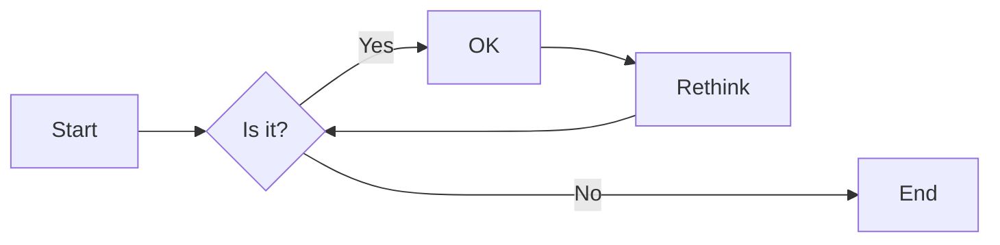
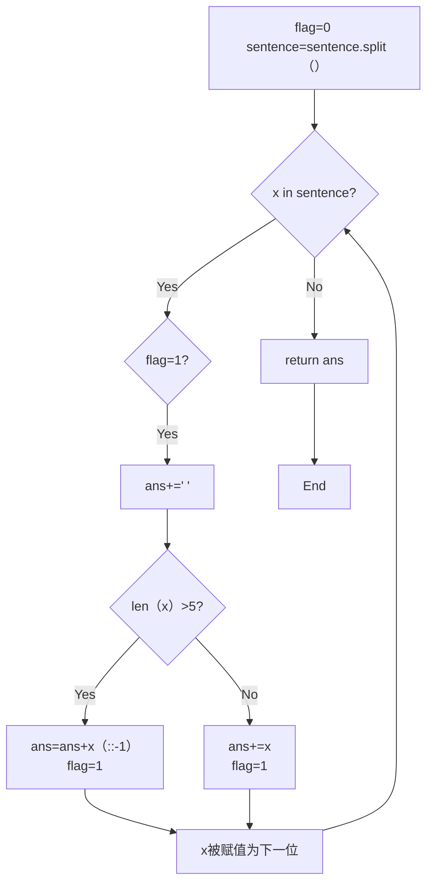

# 实验五 Python数据结构与数据模型

班级： 21计科1

学号： B20210302129

姓名： 吴俊君

Github地址：<https://github.com/TYRandall/course>

CodeWars地址：<https://www.codewars.com/users/Ethereal__>

---

## 实验目的

1. 学习Python数据结构的高级用法
2. 学习Python的数据模型

## 实验环境

1. Git
2. Python 3.10
3. VSCode
4. VSCode插件

## 实验内容和步骤

### 第一部分

在[Codewars网站](https://www.codewars.com)注册账号，完成下列Kata挑战：

---

#### 第一题：停止逆转我的单词

难度： 6kyu

编写一个函数，接收一个或多个单词的字符串，并返回相同的字符串，但所有5个或更多的字母单词都是相反的（就像这个Kata的名字一样）。传入的字符串将只由字母和空格组成。只有当出现一个以上的单词时，才会包括空格。
例如：

```python
spinWords( "Hey fellow warriors" ) => returns "Hey wollef sroirraw" 
spinWords( "This is a test") => returns "This is a test" 
spinWords( "This is another test" )=> returns "This is rehtona test"
```

代码提交地址：
<https://www.codewars.com/kata/5264d2b162488dc400000001>

提示：

- 利用str的split方法可以将字符串分为单词列表
例如：

```python
words = "hey fellow warrior".split()
# words should be ['hey', 'fellow', 'warrior']
```

- 利用列表推导将长度大于等于5的单词反转(利用切片word[::-1])
- 最后使用str的join方法连结列表中的单词。

---

#### 第二题： 发现离群的数(Find The Parity Outlier)

难度：6kyu

给你一个包含整数的数组（其长度至少为3，但可能非常大）。该数组要么完全由奇数组成，要么完全由偶数组成，除了一个整数N。请写一个方法，以该数组为参数，返回这个 "离群 "的N。

例如：

```python
[2, 4, 0, 100, 4, 11, 2602, 36]
# Should return: 11 (the only odd number)

[160, 3, 1719, 19, 11, 13, -21]
# Should return: 160 (the only even number)
```

代码提交地址：
<https://www.codewars.com/kata/5526fc09a1bbd946250002dc>

---

#### 第三题： 检测Pangram

难度：6kyu

pangram是一个至少包含每个字母一次的句子。例如，"The quick brown fox jumps over the lazy dog "这个句子就是一个pangram，因为它至少使用了一次字母A-Z（大小写不相关）。

给定一个字符串，检测它是否是一个pangram。如果是则返回`True`，如果不是则返回`False`。忽略数字和标点符号。
代码提交地址：
<https://www.codewars.com/kata/545cedaa9943f7fe7b000048>

---

#### 第四题： 数独解决方案验证

难度：6kyu

数独背景

数独是一种在 9x9 网格上进行的游戏。游戏的目标是用 1 到 9 的数字填充网格的所有单元格，以便每一列、每一行和九个 3x3 子网格（也称为块）中的都包含数字 1 到 9。更多信息请访问：<http://en.wikipedia.org/wiki/Sudoku>

编写一个函数接受一个代表数独板的二维数组，如果它是一个有效的解决方案则返回 true，否则返回 false。数独板的单元格也可能包含 0，这将代表空单元格。包含一个或多个零的棋盘被认为是无效的解决方案。棋盘总是 9 x 9 格，每个格只包含 0 到 9 之间的整数。

代码提交地址：
<https://www.codewars.com/kata/63d1bac72de941033dbf87ae>

---

#### 第五题： 疯狂的彩色三角形

难度： 2kyu

一个彩色的三角形是由一排颜色组成的，每一排都是红色、绿色或蓝色。连续的几行，每一行都比上一行少一种颜色，是通过考虑前一行中的两个相接触的颜色而产生的。如果这些颜色是相同的，那么新的一行就使用相同的颜色。如果它们不同，则在新的一行中使用缺失的颜色。这个过程一直持续到最后一行，只有一种颜色被生成。

例如：
```python
Colour here:            G G        B G        R G        B R
Becomes colour here:     G          R          B          G
```


一个更大的三角形例子：

```python
R R G B R G B B
 R B R G B R B
  G G B R G G
   G R G B G
    B B R R
     B G R
      R B
       G
```

你将得到三角形的第一行字符串，你的工作是返回最后的颜色，这将出现在最下面一行的字符串。在上面的例子中，你将得到 "RRGBRGBB"，你应该返回 "G"。
限制条件： 1 <= length(row) <= 10 ** 5
输入的字符串将只包含大写字母'B'、'G'或'R'。

例如：

```python
triangle('B') == 'B'
triangle('GB') == 'R'
triangle('RRR') == 'R'
triangle('RGBG') == 'B'
triangle('RBRGBRB') == 'G'
triangle('RBRGBRBGGRRRBGBBBGG') == 'G'
```

代码提交地址：
<https://www.codewars.com/kata/5a331ea7ee1aae8f24000175>

提示：请参考下面的链接，利用三进制的特点来进行计算。
<https://stackoverflow.com/questions/53585022/three-colors-triangles>

---

### 第二部分

使用Mermaid绘制程序流程图

安装VSCode插件：

- Markdown Preview Mermaid Support
- Mermaid Markdown Syntax Highlighting

使用Markdown语法绘制你的程序绘制程序流程图（至少一个），Markdown代码如下：


显示效果如下：



查看Mermaid流程图语法-->[点击这里](https://mermaid.js.org/syntax/flowchart.html)

使用Markdown编辑器（例如VScode）编写本次实验的实验报告，包括[实验过程与结果](#实验过程与结果)、[实验考查](#实验考查)和[实验总结](#实验总结)，并将其导出为 **PDF格式** 来提交。

## 实验过程与结果

### 第一部分 Codewars Kata挑战

#### [第一题：停止逆转我的单词](<https://www.codewars.com/kata/5264d2b162488dc400000001>)

Code:

```python
def spin_words(sentence):
    ans=''
    flag=0
    sentence=sentence.split()
    for x in sentence:
        if(flag==1):
                ans+=' '
        if len(x)>=5:
            ans=ans+x[::-1]
            flag=1
        else:
            ans+=x
            flag=1
    return ans
```

---

#### [第二题： 发现离群的数(Find The Parity Outlier)](<https://www.codewars.com/kata/5526fc09a1bbd946250002dc>)

Code:

```python
def find_outlier(integers):
    flag=0
    if((integers[-1]+integers[-2])%2==1 and (integers[-3]+integers[-2])%2==0):
        return (integers[-1]) 
    if((integers[0]+integers[1])%2==1 and (integers[1]+integers[2])%2==0):
        return (integers[0]) 
    for i in range(0,len(integers)-1):
        if((integers[i]+integers[i+1])%2==1):
            if(flag==1):
                return (integers[i]) 
            flag=1
```

---

#### [第三题： 检测Pangram](<https://www.codewars.com/kata/545cedaa9943f7fe7b000048>)

Code:

```python
def is_pangram(s):
    s=s.lower()
    dic={}
    for i in s:
        if i not in dic:
            dic[i] = 1
        else:
            dic[i] += 1
    for x in range(0,26):
        if chr(x+97) not in dic:
            return False
    return True
```

---

#### [第四题： 数独解决方案验证](<https://www.codewars.com/kata/63d1bac72de941033dbf87ae>)

Code:

```python
def validate_sudoku(board):
    import numpy as np
    board=np.array(board)
    for x in range(0,9):
        if 0 in board[x]:
            return False
    for x in range(0,9):
        dic={}
        for y in board[x]:
            if y not in dic:
                dic[y]=1
            else:
                return False
        dic2={}
        for y in board[:,x]:
            if y not in dic2:
                dic2[y]=1
            else:
                return False
    boxes= [{} for i in range(9)]
    for i in range(9):
        for j in range(9):
            num = board[i][j]
            if num != '.':
                num = int(num)
                box_index = (i // 3 ) * 3 + j // 3
                boxes[box_index][num] = boxes[box_index].get(num, 0) + 1
                if boxes[box_index][num] > 1:
                    return False
    return True
```

---

#### [第五题： 疯狂的彩色三角形](<https://www.codewars.com/kata/5a331ea7ee1aae8f24000175>)

Code：

```python
from math import log
def triangle(row):
    rules = {'RR': 'R', 'GG': 'G', 'BB': 'B',
         'BG': 'R', 'RB': 'G', 'RG': 'B',
         'GB': 'R', 'BR': 'G', 'GR': 'B'}
    n = len(row)
    if n == 1:
        return row
    d = n - 3**int(log(n-1, 3))
    return rules[triangle(row[:d]) + triangle(row[-d:])]
```

### 第二部分 使用Mermaid绘制程序流程图

Code:

```python
def spin_words(sentence):
    ans=''
    flag=0
    sentence=sentence.split()
    for x in sentence:
        if(flag==1):
                ans+=' '
        if len(x)>=5:
            ans=ans+x[::-1]
            flag=1
        else:
            ans+=x
            flag=1
    return ans
```



---

## 实验考查

请使用自己的语言并使用尽量简短代码示例回答下面的问题，这些问题将在实验检查时用于提问和答辩以及实际的操作。

1. 集合（set）类型有什么特点？它和列表（list）类型有什么区别？
    - 集合（Set）：
    - 集合中的元素是唯一的，即没有重复的元素。
    - 集合是无序的，即元素在集合中的顺序是不确定的。
    - 集合可以进行并集、交集、差集等集合运算。
    - 集合在检查元素是否包含在集合中时，速度非常快（时间复杂度为O(1)）。
    - 列表（List）：
    - 列表中的元素可以重复。
    - 列表是有序的，即元素在列表中的顺序是按照添加的顺序排列的。
    - 列表可以包含不同类型的元素。
    - 在列表中插入或删除元素的效率通常比集合高（因为集合需要检查元素的唯一性）。
    - 区别：集合和列表的主要区别在于它们是否允许重复的元素和它们的顺序性。
2. 集合（set）类型主要有那些操作？
    - 对于集合类型，可以执行添加、更新、删除、检查元素是否存在于集合中、测试一个集合是否是另一个集合的子集或超集、并集、交集、差集、对称差集。
3. 使用`*`操作符作用到列表上会产生什么效果？为什么不能使用`*`操作符作用到嵌套的列表上？使用简单的代码示例说明。

    ```python
    my_list = [1, 2, 3, 4, 5]  
    print(*my_list)  # 输出：1 2 3 4 5
    ```

    ```python
    nested_list = [[1, 2], [3, 4], [5, 6]]  
    print(*nested_list)  # [1, 2] [3, 4] [5, 6]
    ```
    
4. 总结列表,集合，字典的解析（comprehension）的使用方法。使用简单的代码示例说明。
    - 1. 列表解析
    - 列表解析是生成新列表的一种简洁方式，它使用for循环和表达式在一行内生成列表。
    - 例如，我们可以使用列表解析将一个整数列表的每个元素加倍：

    ```python
    numbers = [1, 2, 3, 4, 5]  
    doubled_numbers = [number * 2 for number in numbers]  
    print(doubled_numbers)  # 输出：[2, 4, 6, 8, 10]
    ```

    - 2. 集合解析
    - 集合解析与列表解析非常相似，但生成的集合中的元素是唯一的，即没有重复的元素。

    - 例如，我们可以使用集合解析来从一个字符串列表中提取所有的元音字母：

    ```python
    words = ['apple', 'banana', 'cherry', 'date']  
    vowels = {word for word in words if word[0].lower() in 'aeiou'}  
    print(vowels)  # 输出：{'a', 'e', 'i', 'o', 'u'}
    ```


    - 1. 字典解析

    - 字典解析可以用来生成新的字典。在字典解析中，我们使用for循环来迭代一个或多个键值对，并将它们组合成一个新的键值对。

    - 例如，我们可以使用字典解析来从一个整数列表中生成一个新的字典，其中每个数字都是键，对应的值是其平方：

    ```python
    numbers = [1, 2, 3, 4, 5]  
    squared_dict = {number: number ** 2 for number in numbers}  
    print(squared_dict)  # 输出：{1: 1, 2: 4, 3: 9, 4: 16, 5: 25}
    ```

## 实验总结

这次实验让我对Python数据结构和数据模型有了更深入的理解和掌握。我学习了如何使用列表实现栈和队列，掌握了如何使用集合实现并查集，以及如何使用字典实现哈希表。这些知识将有助于我在实际编程中更好地处理和操作数据。

通过实验，我了解到数据结构是解决实际问题的重要工具，而Python提供了丰富多样的数据结构，可以满足不同的需求。同时，数据模型也是理解数据的重要手段，通过了解数据模型的性质和操作，我们可以更好地理解和分析数据。

在实验过程中，我还学习了如何使用Python的对象模型来创建和操作数据对象，以及如何使用Python的内置函数来对数据进行操作和分析。这些知识将有助于我更好地理解和应用Python编程。

总之，这次实验让我对Python数据结构和数据模型有了更深入的理解和应用能力，对我的编程技能将产生积极的影响。