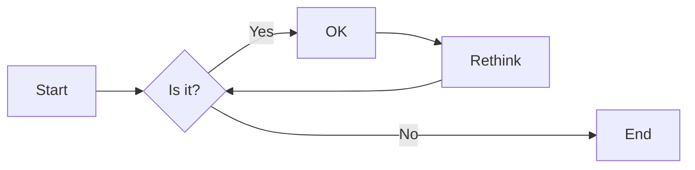
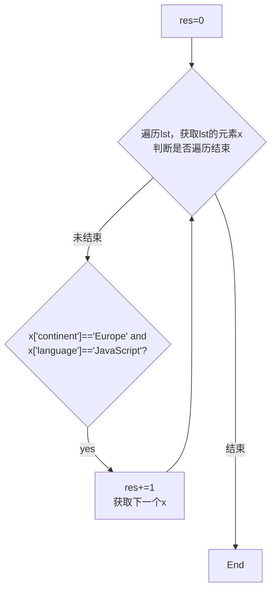

# 实验六 Python函数

班级： 21计科1

学号： B20210302129

姓名： 吴俊君

Github地址：<https://github.com/TYRandall/course>

CodeWars地址：<https://www.codewars.com/users/Ethereal__>

---

## 实验目的

1. 学习Python函数的基本用法
2. 学习lambda函数和高阶函数的使用
3. 掌握函数式编程的概念和实践

## 实验环境

1. Git
2. Python 3.10
3. VSCode
4. VSCode插件

## 实验内容和步骤

### 第一部分

Python函数

完成教材《Python编程从入门到实践》下列章节的练习：

- 第8章 函数

---

### 第二部分

在[Codewars网站](https://www.codewars.com)注册账号，完成下列Kata挑战：

---

#### 第一题：编码聚会1

难度： 7kyu

你将得到一个字典数组，代表关于首次报名参加你所组织的编码聚会的开发者的数据。
你的任务是返回来自欧洲的JavaScript开发者的数量。
例如，给定以下列表：

```python
lst1 = [
  { 'firstName': 'Noah', 'lastName': 'M.', 'country': 'Switzerland', 'continent': 'Europe', 'age': 19, 'language': 'JavaScript' },
  { 'firstName': 'Maia', 'lastName': 'S.', 'country': 'Tahiti', 'continent': 'Oceania', 'age': 28, 'language': 'JavaScript' },
  { 'firstName': 'Shufen', 'lastName': 'L.', 'country': 'Taiwan', 'continent': 'Asia', 'age': 35, 'language': 'HTML' },
  { 'firstName': 'Sumayah', 'lastName': 'M.', 'country': 'Tajikistan', 'continent': 'Asia', 'age': 30, 'language': 'CSS' }
]
```

你的函数应该返回数字1。
如果，没有来自欧洲的JavaScript开发人员，那么你的函数应该返回0。

注意：
字符串的格式将总是"Europe"和"JavaScript"。
所有的数据将始终是有效的和统一的，如上面的例子。

这个卡塔是Coding Meetup系列的一部分，其中包括一些简短易行的卡塔，这些卡塔是为了让人们掌握高阶函数的使用。在Python中，这些方法包括：`filter`, `map`, `reduce`。当然也可以采用其他方法来解决这些卡塔。

[代码提交地址](https://www.codewars.com/kata/coding-meetup-number-1-higher-order-functions-series-count-the-number-of-javascript-developers-coming-from-europe)

---

#### 第二题： 使用函数进行计算

难度：5kyu

这次我们想用函数来写计算，并得到结果。让我们看一下一些例子：

```python
seven(times(five())) # must return 35
four(plus(nine())) # must return 13
eight(minus(three())) # must return 5
six(divided_by(two())) # must return 3
```

要求：

- 从0（"零"）到9（"九"）的每个数字都必须有一个函数。
- 必须有一个函数用于以下数学运算：加、减、乘、除。
- 每个计算都由一个操作和两个数字组成。
- 最外面的函数代表左边的操作数，最里面的函数代表右边的操作数。
- 除法应该是整数除法。

例如，下面的计算应该返回2，而不是2.666666...。

```python
eight(divided_by(three()))
```

代码提交地址：
<https://www.codewars.com/kata/525f3eda17c7cd9f9e000b39>

---

#### 第三题： 缩短数值的过滤器(Number Shortening Filter)

难度：6kyu

在这个kata中，我们将创建一个函数，它返回另一个缩短长数字的函数。给定一个初始值数组替换给定基数的 X 次方。如果返回函数的输入不是数字字符串，则应将输入本身作为字符串返回。

例子：

```python
filter1 = shorten_number(['','k','m'],1000)
filter1('234324') == '234k'
filter1('98234324') == '98m'
filter1([1,2,3]) == '[1,2,3]'
filter2 = shorten_number(['B','KB','MB','GB'],1024)
filter2('32') == '32B'
filter2('2100') == '2KB';
filter2('pippi') == 'pippi'
```

代码提交地址：
<https://www.codewars.com/kata/56b4af8ac6167012ec00006f>

---

#### 第四题： 编码聚会7

难度： 6kyu

您将获得一个对象序列，表示已注册参加您组织的下一个编程聚会的开发人员的数据。

您的任务是返回一个序列，其中包括最年长的开发人员。如果有多个开发人员年龄相同，则将他们按照在原始输入数组中出现的顺序列出。

例如，给定以下输入数组：

```python
list1 = [
  { 'firstName': 'Gabriel', 'lastName': 'X.', 'country': 'Monaco', 'continent': 'Europe', 'age': 49, 'language': 'PHP' },
  { 'firstName': 'Odval', 'lastName': 'F.', 'country': 'Mongolia', 'continent': 'Asia', 'age': 38, 'language': 'Python' },
  { 'firstName': 'Emilija', 'lastName': 'S.', 'country': 'Lithuania', 'continent': 'Europe', 'age': 19, 'language': 'Python' },
  { 'firstName': 'Sou', 'lastName': 'B.', 'country': 'Japan', 'continent': 'Asia', 'age': 49, 'language': 'PHP' },
]
```

您的程序应该返回如下结果：

```python
[
  { 'firstName': 'Gabriel', 'lastName': 'X.', 'country': 'Monaco', 'continent': 'Europe', 'age': 49, 'language': 'PHP' },
  { 'firstName': 'Sou', 'lastName': 'B.', 'country': 'Japan', 'continent': 'Asia', 'age': 49, 'language': 'PHP' },
]
```

注意：

- 输入的列表永远都包含像示例中一样有效的正确格式的数据，而且永远不会为空。

代码提交地址：
<https://www.codewars.com/kata/582887f7d04efdaae3000090>

---

#### 第五题： Currying versus partial application

难度： 4kyu

[Currying versus partial application](https://2ality.com/2011/09/currying-vs-part-eval.html)是将一个函数转换为具有更小arity(参数更少)的另一个函数的两种方法。虽然它们经常被混淆，但它们的工作方式是不同的。目标是学会区分它们。

Currying

是一种将接受多个参数的函数转换为以每个参数都只接受一个参数的一系列函数链的技术。

Currying接受一个函数：

```python
f：X × Y → R
```

并将其转换为一个函数：

```python
f'：X → (Y → R)
```

我们不再使用两个参数调用f，而是使用第一个参数调用f'。结果是一个函数，然后我们使用第二个参数调用该函数来产生结果。因此，如果非curried f被调用为：

```python
f(3, 5)
```

那么curried f'被调用为：

```python
f'(3)(5)
```

示例
给定以下函数：

```python
def add(x, y, z):
  return x + y + z
```

我们可以以普通方式调用：

```python
add(1, 2, 3) # => 6
```

但我们可以创建一个curried版本的add(a, b, c)函数：

```python
curriedAdd = lambda a: (lambda b: (lambda c: add(a,b,c)))
curriedAdd(1)(2)(3) # => 6
```

Partial application
是将一定数量的参数固定到函数中，从而产生另一个更小arity(参数更少)的函数的过程。

部分应用接受一个函数：

```python
f：X × Y → R
```

和一个固定值x作为第一个参数，以产生一个新的函数

```python
f'：Y → R
```

f'与f执行的操作相同，但只需要填写第二个参数，这就是其arity比f的arity少一个的原因。可以说第一个参数绑定到x。

示例:

```python
partialAdd = lambda a: (lambda *args: add(a,*args))
partialAdd(1)(2, 3) # => 6
```

你的任务是实现一个名为curryPartial()的通用函数，可以进行currying或部分应用。

例如：

```python
curriedAdd = curryPartial(add)
curriedAdd(1)(2)(3) # => 6

partialAdd = curryPartial(add, 1)
partialAdd(2, 3) # => 6
```

我们希望函数保持灵活性。

所有下面这些例子都应该产生相同的结果：

```python
curryPartial(add)(1)(2)(3) # =>6 
curryPartial(add, 1)(2)(3) # =>6 
curryPartial(add, 1)(2, 3) # =>6 
curryPartial(add, 1, 2)(3) # =>6 
curryPartial(add, 1, 2, 3) # =>6 
curryPartial(add)(1, 2, 3) # =>6 
curryPartial(add)(1, 2)(3) # =>6 
curryPartial(add)()(1, 2, 3) # =>6 
curryPartial(add)()(1)()()(2)(3) # =>6 

curryPartial(add)()(1)()()(2)(3, 4, 5, 6) # =>6 
curryPartial(add, 1)(2, 3, 4, 5) # =>6 

curryPartial(curryPartial(curryPartial(add, 1), 2), 3) # =>6
curryPartial(curryPartial(add, 1, 2), 3) # =>6
curryPartial(curryPartial(add, 1), 2, 3) # =>6
curryPartial(curryPartial(add, 1), 2)(3) # =>6
curryPartial(curryPartial(add, 1)(2), 3) # =>6
curryPartial(curryPartial(curryPartial(add, 1)), 2, 3) # =>6
```

代码提交地址：
<https://www.codewars.com/kata/53cf7e37e9876c35a60002c9>

---

### 第三部分

使用Mermaid绘制程序流程图

安装VSCode插件：

- Markdown Preview Mermaid Support
- Mermaid Markdown Syntax Highlighting

使用Markdown语法绘制你的程序绘制程序流程图（至少一个），Markdown代码如下：


显示效果如下：



查看Mermaid流程图语法-->[点击这里](https://mermaid.js.org/syntax/flowchart.html)

使用Markdown编辑器（例如VScode）编写本次实验的实验报告，包括[实验过程与结果](#实验过程与结果)、[实验考查](#实验考查)和[实验总结](#实验总结)，并将其导出为 **PDF格式** 来提交。

## 实验过程与结果

请将实验过程与结果放在这里，包括：

- [第一部分 Python函数](#第一部分)
- [第二部分 Codewars Kata挑战](#第二部分)
- [第三部分 使用Mermaid绘制程序流程图](#第三部分)

### 第二部分 Codewars Kata挑战

#### [第一题：编码聚会1](<https://www.codewars.com/kata/coding-meetup-number-1-higher-order-functions-series-count-the-number-of-javascript-developers-coming-from-europe>)

Code:

```python
def count_developers(lst):
    res=0
    for x in lst:
        if x['continent']=='Europe' and x['language']=='JavaScript':
            res+=1
    return res
```

---

#### [第二题： 使用函数进行计算](<https://www.codewars.com/kata/525f3eda17c7cd9f9e000b39>)

Code:

```python
def zero(f = None): return f(0) if callable(f) else 0
def one(f = None): return f(1) if callable(f) else 1
def two(f = None): return f(2) if callable(f) else 2
def three(f = None): return f(3) if callable(f) else 3
def four(f = None): return f(4) if callable(f) else 4
def five(f = None): return f(5) if callable(f) else 5
def six(f = None): return f(6) if callable(f) else 6
def seven(f = None): return f(7) if callable(f) else 7
def eight(f = None): return f(8) if callable(f) else 8
def nine(f = None): return f(9) if callable(f) else 9

def plus(x): return lambda y: x + y
def minus(x): return lambda y: y - x
def times(x): return lambda y: y * x
def divided_by(x): return lambda y:int(y/x)
```

---

#### [第三题： 缩短数值的过滤器(Number Shortening Filter)](<https://www.codewars.com/kata/56b4af8ac6167012ec00006f>)

Code:

```python
def shorten_number(suffixes, base):
    def process(Str):
        if type(Str) != str or Str.isdigit() == False:
            return str(Str)
        count=0
        temp=int(Str)
        while temp//base >0 and count+1<len(suffixes):
            temp=temp//base
            count+=1
        return str(temp)+suffixes[count]
    return process
```

---

#### [第四题： 编码聚会7](<https://www.codewars.com/kata/582887f7d04efdaae3000090>)

Code:

```python
def find_senior(lst): 
    max_age=-1
    list_ans=[]
    for x in lst:
        if x['age'] > max_age:
            max_age=x['age']
    for x in lst:
        if x['age'] == max_age:
            list_ans.append(x)
    return list_ans
```

---

#### [第五题： Currying versus partial application](<https://www.codewars.com/kata/53cf7e37e9876c35a60002c9>)

Code:

```python
def curry_partial(f, *args):  
    if not callable(f): 
        return f
    num_args = f.__code__.co_argcount

    if num_args == 0:
        return f(*args)
    if len(args) >= num_args:
        return f(*args[:num_args])
    def inner(*params):    
        all_args = [*args, *params]
        if not args:
            return curry_partial(f, *all_args)        
        if not callable(args[0]):
            return curry_partial(f, *all_args)
        fn = args[0]
        num_args2 = fn.__code__.co_argcount

        if num_args2 == 0:
            return fn(*all_args)
        if len(all_args) >= num_args2:
            return fn(*all_args[:num_args2])
        else:
            return curry_partial(fn, *all_args)
        
    return inner
```

### 第三部分 使用Mermaid绘制程序流程图

Code:

```python
def count_developers(lst):
    res=0
    for x in lst:
        if x['continent']=='Europe' and x['language']=='JavaScript':
            res+=1
    return res
```



---

## 实验考查

请使用自己的语言并使用尽量简短代码示例回答下面的问题，这些问题将在实验检查时用于提问和答辩以及实际的操作。

1. 什么是函数式编程范式？

   - 函数式编程范式是一种基于函数的计算模型，它强调将计算过程看作是函数之间的转换而不是状态的改变。这种范式可以带来很多优点，例如代码简洁、可读性强、易于并行化和模块化等。

2. 什么是lambda函数？请举例说明。

   - Lambda函数是一种匿名函数，也就是没有名字的函数。它们主要用于短小的函数定义，而无需使用def关键字创建一个正式的函数。Lambda函数在Python中非常常见，并且通常是闭包的一种形式。
   - Lambda函数的基本格式为 lambda arguments: expression。这里，arguments 是函数的参数列表，expression 是函数的主体部分，它返回函数的结果。

   ```python
   add = lambda x, y: x + y  
   print(add(5, 3))  # 输出：8
   ```

3. 什么是高阶函数？常用的高阶函数有哪些？这些高阶函数如何工作？使用简单的代码示例说明。
   - 高阶函数是接受一个或多个函数作为输入（参数）或返回一个函数作为结果的函数。换句话说，高阶函数可以接受函数作为输入，也可以返回函数作为输出。

   - 常用的高阶函数包括map()、filter()、reduce()等。这些函数都接受一个函数作为参数，并在数据集上执行操作。

   - 例如map() 函数：
  
   ```python
   numbers = [1, 2, 3, 4, 5]  
   multiply_by_two = lambda x: x * 2  
   result = map(multiply_by_two, numbers)  
   print(list(result))  # 输出：[2, 4, 6, 8, 10]
   ```

   - 例如filter() 函数：
  
   ```python
   numbers = [1, 2, 3, 4, 5]  
   is_even = lambda x: x % 2 == 0  
   result = filter(is_even, numbers)  
   print(list(result))  # 输出：[2, 4]
   ```

## 实验总结

通过本次实验，我深入学习了Python函数的基本用法，包括函数的定义、调用、参数传递和返回值等概念。此外，我还学习了lambda函数和高阶函数的使用，了解到lambda函数可以用来创建匿名函数，而高阶函数则可以接受或返回其他函数作为参数或返回值。

在实践中，我掌握了函数式编程的概念并进行了相关的编程练习。函数式编程强调将计算过程看作是函数之间的转换，通过组合和传递函数来实现复杂的业务逻辑。这种编程范式具有代码简洁、可读性强、易于并行化和模块化等优点。

本次实验让我深入学习了Python函数的基本用法和函数式编程的概念，并掌握了lambda函数和高阶函数的使用。这些知识和技能将对我的编程能力和未来的工作产生积极的影响。