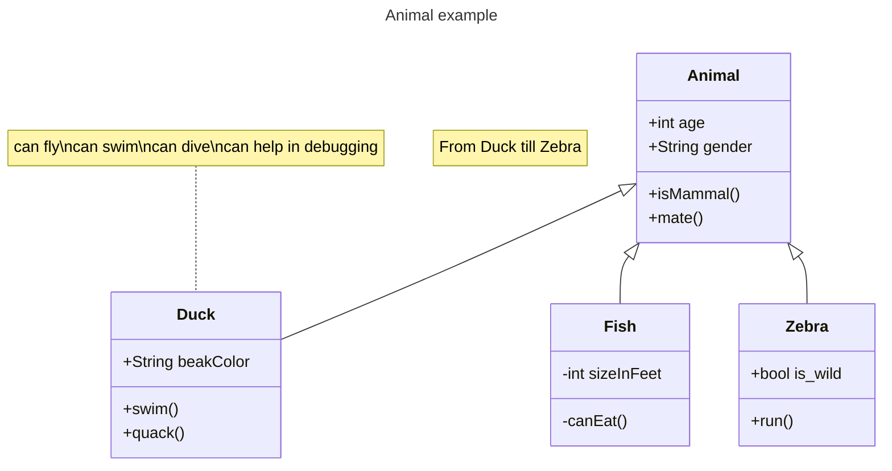
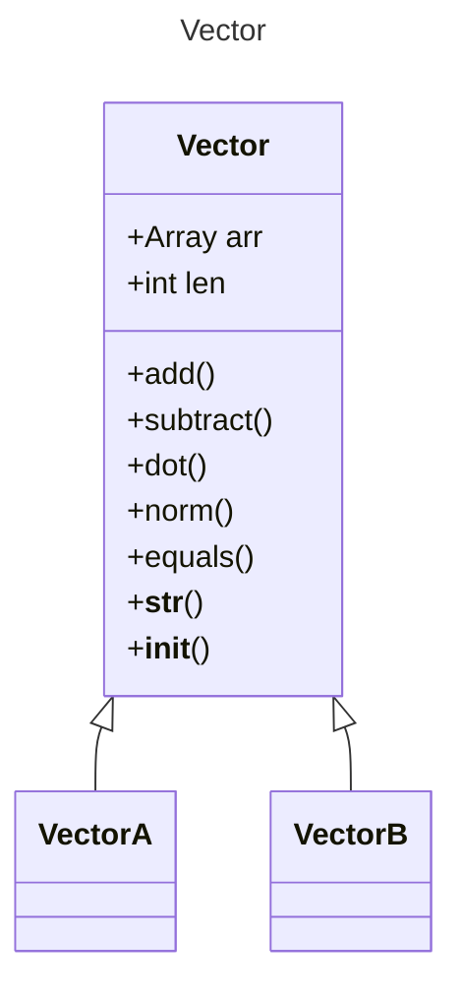

# 实验七 Python面向对象编程

班级： 21计科1

学号： B20210302129

姓名： 吴俊君

Github地址：<https://github.com/TYRandall/course>

CodeWars地址：<https://www.codewars.com/users/Ethereal__>

---

## 实验目的

1. 学习Python类和继承的基础知识
2. 学习namedtuple和DataClass的使用

## 实验环境

1. Git
2. Python 3.10
3. VSCode
4. VSCode插件

## 实验内容和步骤

### 第一部分

Python面向对象编程

完成教材《Python编程从入门到实践》下列章节的练习：

- 第9章 类

---

### 第二部分

在[Codewars网站](https://www.codewars.com)注册账号，完成下列Kata挑战：

---

#### 第一题：面向对象的海盗

难度： 8kyu

啊哈，伙计!

你是一个小海盗团的首领。而且你有一个计划。在OOP的帮助下，你希望建立一个相当有效的系统来识别船上有大量战利品的船只。
对你来说，不幸的是，现在的人很重，那么你怎么知道一艘船上装的是黄金而不是人呢？

你首先要写一个通用的船舶类。

```python
class Ship:
    def __init__(self, draft, crew):
        self.draft = draft
        self.crew = crew
```

每当你的间谍看到一艘新船进入码头，他们将根据观察结果创建一个新的船舶对象。

- `draft`吃水 - 根据船在水中的高度来估计它的重量
- `crew`船员 - 船上船员的数量

`Titanic = Ship(15, 10)`

任务

你可以访问船舶的 "draft(吃水) "和 "crew(船员)"。"draft(吃水) "是船的总重量，"船员 "是船上的人数。
每个船员都会给船的吃水增加1.5个单位。如果除去船员的重量后，吃水仍然超过20，那么这艘船就值得掠夺。任何有这么重的船一定有很多战利品!
添加方法
`is_worth_it`
来决定这艘船是否值得掠夺。

例如：

```python
Titanic.is_worth_it()
False
```

祝你好运，愿你能找到金子!

代码提交地址：
<https://www.codewars.com/kata/54fe05c4762e2e3047000add>

---

#### 第二题： 搭建积木

难度：7kyu

写一个创建Block的类（Duh.）
构造函数应该接受一个数组作为参数，这个数组将包含3个整数，其形式为`[width, length, height]`，Block应该由这些整数创建。

定义这些方法:

- `get_width()` return the width of the `Block`
- `get_length()` return the length of the `Block`
- `get_height()` return the height of the `Block`
- `get_volume()` return the volume of the `Block`
- `get_surface_area()` return the surface area of the `Block`

例子：

```python
b = Block([2,4,6]) # create a `Block` object with a width of `2` a length of `4` and a height of `6`
b.get_width() # return 2    
b.get_length() # return 4
b.get_height() # return 6
b.get_volume() # return 48
b.get_surface_area() # return 88
```

注意： 不需要检查错误的参数。

代码提交地址：
<https://www.codewars.com/kata/55b75fcf67e558d3750000a3>

---

#### 第三题： 分页助手

难度：5kyu

在这个练习中，你将加强对分页的掌握。你将完成PaginationHelper类，这是一个实用类，有助于查询与数组有关的分页信息。
该类被设计成接收一个值的数组和一个整数，表示每页允许多少个项目。集合/数组中包含的值的类型并不相关。

下面是一些关于如何使用这个类的例子：

```python
helper = PaginationHelper(['a','b','c','d','e','f'], 4)
helper.page_count() # should == 2
helper.item_count() # should == 6
helper.page_item_count(0)  # should == 4
helper.page_item_count(1) # last page - should == 2
helper.page_item_count(2) # should == -1 since the page is invalid

# page_index takes an item index and returns the page that it belongs on
helper.page_index(5) # should == 1 (zero based index)
helper.page_index(2) # should == 0
helper.page_index(20) # should == -1
helper.page_index(-10) # should == -1 because negative indexes are invalid
```

代码提交地址：
<https://www.codewars.com/kata/515bb423de843ea99400000a>

---

#### 第四题： 向量（Vector）类

难度： 5kyu

创建一个支持加法、减法、点积和向量长度的向量（Vector）类。

举例来说：

```python
a = Vector([1, 2, 3])
b = Vector([3, 4, 5])
c = Vector([5, 6, 7, 8])

a.add(b)      # should return a new Vector([4, 6, 8])
a.subtract(b) # should return a new Vector([-2, -2, -2])
a.dot(b)      # should return 1*3 + 2*4 + 3*5 = 26
a.norm()      # should return sqrt(1^2 + 2^2 + 3^2) = sqrt(14)
a.add(c)      # raises an exception
```

如果你试图对两个不同长度的向量进行加减或点缀，你必须抛出一个错误。
向量类还应该提供：

- 一个 `__str__` 方法，这样 `str(a) === '(1,2,3)'` 
- 一个equals方法，用来检查两个具有相同成分的向量是否相等。

注意：测试案例将利用用户提供的equals方法。

代码提交地址：
<https://www.codewars.com/kata/526dad7f8c0eb5c4640000a4>

---

#### 第五题： Codewars风格的等级系统

难度： 4kyu

编写一个名为User的类，用于计算用户在类似于Codewars使用的排名系统中的进步量。

业务规则：

- 一个用户从等级-8开始，可以一直进步到8。
- 没有0（零）等级。在-1之后的下一个等级是1。
- 用户将完成活动。这些活动也有等级。
- 每当用户完成一个有等级的活动，用户的等级进度就会根据活动的等级进行更新。
- 完成活动获得的进度是相对于用户当前的等级与活动的等级而言的。
- 用户的等级进度从零开始，每当进度达到100时，用户的等级就会升级到下一个等级。
- 在上一等级时获得的任何剩余进度都将被应用于下一等级的进度（我们不会丢弃任何进度）。例外的情况是，如果没有其他等级的进展（一旦你达到8级，就没有更多的进展了）。
- 一个用户不能超过8级。
- 唯一可接受的等级值范围是-8,-7,-6,-5,-4,-3,-2,-1,1,2,3,4,5,6,7,8。任何其他的值都应该引起错误。

逻辑案例：

- 如果一个排名为-8的用户完成了一个排名为-7的活动，他们将获得10的进度。
- 如果一个排名为-8的用户完成了排名为-6的活动，他们将获得40的进展。
- 如果一个排名为-8的用户完成了排名为-5的活动，他们将获得90的进展。
- 如果一个排名-8的用户完成了排名-4的活动，他们将获得160个进度，从而使该用户升级到排名-7，并获得60个进度以获得下一个排名。
- 如果一个等级为-1的用户完成了一个等级为1的活动，他们将获得10个进度（记住，零等级会被忽略）。

代码案例：

```python
user = User()
user.rank # => -8
user.progress # => 0
user.inc_progress(-7)
user.progress # => 10
user.inc_progress(-5) # will add 90 progress
user.progress # => 0 # progress is now zero
user.rank # => -7 # rank was upgraded to -7
```

代码提交地址：
<https://www.codewars.com/kata/51fda2d95d6efda45e00004e>

---

### 第三部分

使用Mermaid绘制程序的**类图**

安装VSCode插件：

- Markdown Preview Mermaid Support
- Mermaid Markdown Syntax Highlighting

使用Markdown语法绘制你的程序绘制程序类图（至少一个），Markdown代码如下：


显示效果如下：



查看Mermaid类图的语法-->[点击这里](https://mermaid.js.org/syntax/classDiagram.html)

使用Markdown编辑器（例如VScode）编写本次实验的实验报告，包括[实验过程与结果](#实验过程与结果)、[实验考查](#实验考查)和[实验总结](#实验总结)，并将其导出为 **PDF格式** 来提交。

## 实验过程与结果

请将实验过程与结果放在这里，包括：

- [第一部分 Python面向对象编程](#第一部分)
- [第二部分 Codewars Kata挑战](#第二部分)
- [第三部分 使用Mermaid绘制程序流程图](#第三部分)

### 第二部分 Codewars Kata挑战

#### [第一题：面向对象的海盗](<https://www.codewars.com/kata/54fe05c4762e2e3047000add>)

Code:

```python
class Ship:
    def __init__(self, draft, crew):
        self.draft = draft
        self.crew = crew
    def is_worth_it(self):
        if self.draft-self.crew*1.5>20:
            return True
        else:
            return False
```

---

#### [第二题： 搭建积木](<https://www.codewars.com/kata/55b75fcf67e558d3750000a3>)

Code:

```python
class Block:
    def __init__(self,inf):
        self.width=inf[0]
        self.length=inf[1]
        self.height=inf[2]
    def get_width(self):
        return self.width
    def get_length(self):
        return self.length
    def get_height(self):
        return self.height
    def get_volume(self):
        return self.width*self.height*self.length
    def get_surface_area(self):
        return 2*(self.width*self.height)+2*(self.width*self.length)+2*(self.height*self.length)
```

---

#### [第三题： 分页助手](<https://www.codewars.com/kata/515bb423de843ea99400000a>)

Code:

```python
class PaginationHelper:
    
    def __init__(self, collection, items_per_page):
        self.collection=collection
        self.len=len(collection)
        self.page=items_per_page
    
    # returns the number of items within the entire collection
    def item_count(self):
        return self.len
    
    # returns the number of pages
    def page_count(self):
        if self.len%self.page ==0 :
            return self.len//self.page
        else:
            return self.len//self.page +1 

    
    # returns the number of items on the given page. page_index is zero based
    # this method should return -1 for page_index values that are out of range
    def page_item_count(self, page_index):
        if page_index < 0 or page_index >= self.page_count():
            return -1
        if self.len%self.page ==0 :
            return self.page
        else:
            if page_index == self.page_count()-1:
                return self.len%self.page
            else:
                return self.page
    
    # determines what page an item at the given index is on. Zero based indexes.
    # this method should return -1 for item_index values that are out of range
    def page_index(self, item_index):
        if item_index < 0 or item_index >=self.len:
            return -1
        return item_index//self.page
```

---

#### [第四题： 向量（Vector）类](<https://www.codewars.com/kata/526dad7f8c0eb5c4640000a4>)

Code:

```python
from math import sqrt

class Vector:
    def __init__(self,arr):
        self.arr=arr
        self.len=len(self.arr)
    
    def add(self,b):
        if self.len != b.len:
            raise ValueError
        temp=Vector([])
        for i in range(self.len):
            temp.arr.append(self.arr[i]+b.arr[i])
            temp.len+=1
        return temp
    
    def subtract(self,b):
        if self.len != b.len:
            raise ValueError
        temp=Vector([])
        for i in range(self.len):
            temp.arr.append(self.arr[i]-b.arr[i])
            temp.len+=1
        return temp
    
    def dot(self,b):
        if self.len != b.len:
            raise ValueError
        sum=0
        for i in range(self.len):
            sum+=self.arr[i]*b.arr[i]
        return sum
    
    def norm(self):
        sum=0
        for i in range(self.len):
            sum+=self.arr[i]**2
        return sqrt(sum)
    
    def equals(self,b):
        if self.len != b.len:
            return False
        for i in range(self.len):
            if self.arr[i] != b.arr[i]:
                return False
        return True
    
    def __str__(self):
        Str='('
        for x in self.arr:
            Str=Str+str(x);
            if x!=self.arr[-1]:
                Str=Str+','
        Str=Str+')'
        return Str;
```

---

#### [第五题： Codewars风格的等级系统](<https://www.codewars.com/kata/51fda2d95d6efda45e00004e>)

Code:

```python
dic={-8:0,-7:1,-6:2,-5:3,-4:4,-3:5,-2:6,-1:7,1:8,2:9,3:10,4:11,5:12,6:13,7:14,8:15}

class User:
    def __init__(self):
        self.rank=-8
        self.RANKS = [-8, -7, -6, -5, -4, -3, -2, -1, 1, 2, 3, 4, 5, 6, 7, 8]
        self.index=0
        self.progress=0
        
    def check(self):
        while self.progress>=100:
            self.progress-=100
            self.index+=1
            self.rank = self.RANKS[self.index]
            if self.rank>=8:
                self.rank=8
                self.progress=0
                return
        
            
    
    def inc_progress(self,testRank):
        rank_index = self.RANKS.index(testRank)
        if rank_index==self.index:
            self.progress+=3
            
        if rank_index==self.index-1:
            self.progress+=1
            
        if rank_index>self.index:
            sub = rank_index-self.index
            self.progress+=10*sub*sub
            
        self.check()
        if self.rank>=8:
            self.rank=8
            self.progress=0
```

---

### 第三部分 使用Mermaid绘制程序流程图

Code:

```python
class Vector:
    def __init__(self,arr):
        self.arr=arr
        self.len=len(self.arr)
    
    def add(self,b):
        if self.len != b.len:
            raise ValueError
        temp=Vector([])
        for i in range(self.len):
            temp.arr.append(self.arr[i]+b.arr[i])
            temp.len+=1
        return temp
    
    def subtract(self,b):
        if self.len != b.len:
            raise ValueError
        temp=Vector([])
        for i in range(self.len):
            temp.arr.append(self.arr[i]-b.arr[i])
            temp.len+=1
        return temp
    
    def dot(self,b):
        if self.len != b.len:
            raise ValueError
        sum=0
        for i in range(self.len):
            sum+=self.arr[i]*b.arr[i]
        return sum
    
    def norm(self):
        sum=0
        for i in range(self.len):
            sum+=self.arr[i]**2
        return sqrt(sum)
    
    def equals(self,b):
        if self.len != b.len:
            return False
        for i in range(self.len):
            if self.arr[i] != b.arr[i]:
                return False
        return True
    
    def __str__(self):
        Str='('
        for x in self.arr:
            Str=Str+str(x);
            if x!=self.arr[-1]:
                Str=Str+','
        Str=Str+')'
        return Str;
```



## 实验考查

请使用自己的语言并使用尽量简短代码示例回答下面的问题，这些问题将在实验检查时用于提问和答辩以及实际的操作。

1. Python的类中__init__方法起什么作用？

    - 在Python中，__init__方法是一个特殊的方法，通常用于在创建类的新实例时进行初始化操作。当你使用class关键字创建一个新类并使用new_object = ClassName()来创建一个该类的实例时，Python会自动调用__init__方法。

    - 具体来说，__init__方法允许你在创建新对象时设置初始状态，或者为对象的属性赋予默认值。当一个类被实例化时，如果没有提供任何参数，那么__init__方法可以用来进行一些必要的准备工作

2. Python语言中如何继承父类和改写（override）父类的方法。

    ```python
    class ParentClass:  
        def method(self):  
            print("这是父类的方法")  
  
    class ChildClass(ParentClass):  #继承父类的方法
        def method(self):  # 重写父类的方法  
            super().method()  # 调用父类的方法  
            print("这是子类改写后的方法")
    ```

3. Python类有那些特殊的方法？它们的作用是什么？请举三个例子并编写简单的代码说明。

    - Python类有许多特殊的方法，这些方法以双下划线开头和结尾，例如__init__()\、\_\_str__()等。这些特殊方法在Python中被称为魔法方法或者双下划线方法。它们在特定的场合被Python解释器自动调用，让开发者可以在特定的时间执行特定的代码。这里举三个例子来说明：

    - \_\_init__()：这是一个构造方法，当一个对象被创建时，Python会自动调用这个方法。这个方法通常用于初始化一个新创建的对象的状态。

    ```python
    class MyClass:  
        def __init__(self, name):  
            self.name = name  
    
    obj = MyClass('John')  
    print(obj.name)  # 输出：John
    ```

   -\_\_str__()'：这个方法在将对象转换为字符串时被调用。它通常用于定义对象的字符串表示形式。

    ```python
    class MyClass:  
        def __init__(self, name):  
            self.name = name  
        def __str__(self):  
            return f'My name is {self.name}'  
    
    obj = MyClass('John')  
    print(str(obj))  # 输出：My name is John
    ```

    -\_\_call__()：这个方法使对象能够像函数一样被调用。当尝试像函数一样调用一个对象时，Python会自动调用这个方法。

    ```python
    class MyClass:  
        def __call__(self, x):  
            return x * x  
    
    obj = MyClass()  
    result = obj(5)  # 输出：25  
    print(result)  # 输出：25
    ```

## 实验总结

本次实验旨在学习Python类和继承的基础知识，以及掌握namedtuple和DataClass的使用。通过编写一个简单的Python类，了解类的定义、实例化和继承等基础知识。同时，通过使用namedtuple和DataClass，实现对数据的更高效且更具可读性的处理。

我们学习了namedtuple和DataClass。namedtuple是一个可以返回元组的类，它可以将一组数据封装成一个有序的元组，并且每个元组都可以通过属性名来访问。而DataClass是一个用于创建数据类的类，它可以帮助我们简化数据类的创建过程，并自动生成属性和方法的访问器。

通过本次实验，我们不仅掌握了Python类和继承的基础知识，还学会了如何使用namedtuple和DataClass来更高效地处理数据。