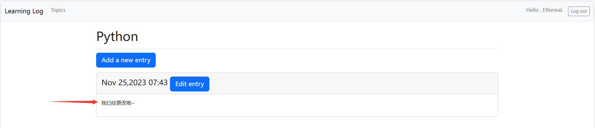

# 《Python程序设计基础》程序设计作品说明书

题目： 学习笔记Web应用程序🕸️

学院： 21计科

姓名： 吴俊君

学号： B20210302129

指导教师： 周景

起止日期：2023.11.10-2023.12.10

## 摘要

### 项目概述

本次设计完成的项目是一个学习笔记Web应用程序，它可以帮助用户创建和管理学习笔记，同时也可以让用户输入数据、创建用户账户，并拥有自己的数据。该应用程序基于教材18-20章的功能要求，通过Python Django框架实现。

### 主要内容

本文主要介绍了如何设计和实现一个学习笔记Web应用程序，包括以下内容：

    - 创建Web应用程序、创建学习笔记主页、创建其他页面；
    - 让用户输入数据、创建用户账户；
    - 让用户拥有自己的数据；
    - 设置项目学习笔记的样式；
    - 部署学习笔记Web应用程序。
  
主要完成的工作：

    - 根据教材要求，完成学习笔记Web应用程序的设计和开发工作；
    - 编写了学习笔记Web应用程序的代码，包括主页和其他页面的代码；
    - 实现了用户输入数据、创建用户账户的功能；
    - 实现了用户拥有自己的数据的功能；
    - 使用Bootstrap设置了学习笔记Web应用程序的样式；
    - 部署了学习笔记Web应用程序到服务器上。

关键词：学习笔记Web应用程序、Python Django框架、用户输入数据、创建用户账户、拥有自己的数据、Bootstrap设置样式、部署应用程序。

## 第1章 需求分析

对于学习笔记Web应用程序，系统的需求分析主要包括以下几个方面：

1. 用户需求：系统需要满足哪些用户的需求？例如，学生需要记录课堂笔记、整理知识点；教师需要发布课程资料、布置作业等。
2. 功能需求：系统需要实现哪些功能？例如，创建笔记、编辑笔记、删除笔记等。
3. 数据需求：系统需要处理哪些数据？例如，用户信息、笔记信息、文件信息等。

通过深入了解用户需求和功能需求，我们可以明确学习笔记Web应用程序的主要功能模块，包括：

1. 用户注册登录模块：用于用户注册、登录功能。
2. 笔记创建模块：用于创建笔记。
3. 笔记编辑模块：用于编辑已创建的笔记。
4. 笔记管理模块：用于管理笔记，可以进行分类等操作。

综上所述，通过需求分析明确了系统的功能模块和可以帮助用户解决的问题，为后续的系统设计和开发提供了重要的依据。在学习笔记Web应用程序的开发过程中，还需要根据实际需求和技术条件进行具体的系统设计、开发和测试工作。

## 第2章 分析与设计

### 系统架构

在本项目中，我们将采用Python的Django框架作为基础架构。Django是一个成熟的Python Web框架，它提供了许多现成的组件和工具，可以帮助我们快速地构建Web应用程序。在Django中，MVC架构被广泛采用，因此我们可以将应用程序的设计和开发划分为三个主要组成部分：模型（Model）、视图（View）和控制器（Controller）。

### 系统流程

学习笔记Web应用程序的主要流程如下：

1. 用户注册与登录：用户通过填写注册表单创建账户，然后登录系统。登录后，用户可以进入学习笔记的主页面。
2. 创建/编辑笔记：在主页面中，用户可以看到他们的笔记列表。点击“新建笔记”按钮后，会打开一个新的页面，用户可以在此输入笔记的标题和内容。

### 系统模块

学习笔记Web应用程序主要包括以下几个模块：

用户模块：处理用户的注册、登录和身份验证。
笔记模块：处理笔记的创建、编辑。

### 数据库设计

学习笔记Web应用程序的数据库设计主要考虑以下实体：

1. 用户：包括用户ID、用户名、密码、电子邮件等字段。
2. 笔记：包括笔记主题名字、用户ID（外键）、标题、内容、创建时间等字段。

### 关键实现

在学习笔记Web应用程序的开发中，以下是一些关键的实现细节：

1. 使用ORM进行数据库操作：通过Django的ORM，我们可以使用Python代码来操作数据库，而不需要手动编写SQL语句。ORM使得数据模型的创建和数据存储变得更容易和更直观。
2. 使用模板引擎渲染视图：Django的模板引擎使得我们可以将动态数据与HTML模板结合起来，从而创建动态的Web页面。在模板中，我们可以使用变量和模板标签来展示数据和处理逻辑。
3. 使用表单处理用户输入：Django提供了表单组件，可以帮助我们处理用户输入并验证数据的有效性。在创建和编辑笔记时，我们可以使用表单来收集用户的输入并确保数据的正确性。

## 第3章 软件测试

### 单元测试用例

| \#  | 测试目标 | 输入 | 预期结果 | 测试结果 |
| --- | --------- | ----- | ---------------- | ----------------- |
| 1   | 注册用户   |  用户名：Ethereal，密码：123456     |  注册成功，用户信息存储成功   |  成功   |
| 2   | 用户登出   |  用户名：Ethereal，密码：123456     |   登出成功，用户会话被终止      |  成功   |
| 3   | 用户登录   |  用户名：Ethereal，密码：123456     |   登录成功，用户会话被建立      |  成功   |
| 4   | 创建新的主题   |  主题：Python     |   新主题创建成功，主题信息存储成功      |  成功   |
| 5   | 创建新的条目   |  条目：我只是一个测试用例而已啦     |   新条目创建成功，条目信息存储成功      |  成功   |
| 6   | 编辑条目   |  条目：我已经更改咯~     |   条目编辑成功，条目信息更新成功      |  成功   |

### 注册用户

点击右上角的 Register ，先选择注册一个用户：

在这里输入用户名和密码，然后点击 Regist 确认：

然后注册完成会自动跳转到主页，并且账号已经自动登录了：

### 用户登出

在刚刚的基础上，选择右上角的 Log out 登出按钮：

然后会发现，欢迎语已经没有了，变成了 Register 按钮，同时 Log out 变成了 Log in，说明登出成功

### 用户登录

在刚刚的基础上，选择右上角的 Log in 登录按钮：

在新界面输入自己刚刚注册的用户名和密码，然后选择 Log in 确认：

发现欢迎用语回来了，并且显示的是自己刚刚登录的用户名，说明登陆成功：

### 创建新的主题

在首页，点击导航栏处的 Topics，查看当前用户所有的主题：

可以发现由于用户是新注册的，没有添加任何主题，点击 Add a new topic 按钮新添加一个主题：

在这里填入要新加的主题名称即可，此处为 Python ，随后点击 Add topic ：

随后就会回到最开始的界面，发现添加的新主题已经显示在其中了：

### 创建新的条目

在当前页面点击刚刚创建好的 Pythoin 主题：

可以发现这里没有条目，点击 Add a new entry 按钮，新建一条：

在顶上显示了该条目所属的标题名字，随后我们可以在框框中编写自己的笔记内容，编辑完后可以点击 Add entry 按钮确认：

随后跳转到原先界面，就会显示刚刚所添加的内容，包括内容、时间，此时添加条目成功。

### 编辑条目

在当前界面，选择 Edit entry 按钮进入编辑条目的页面：

在当前界面可以在框框中看到原先的内容，我们可以进行编辑，更改完之后点击 Save changes 按钮确认更改，就会回到一开始的界面：

在这里可以看到内容已经被更改了：

## 结论

### 主要功能实现

1. 用户注册和登录系统：允许用户创建账户并登录系统。
2. 笔记创建和编辑：用户可以新建、编辑和删除笔记。

### 达到的目标

提供一个方便用户使用的界面，以创建、编辑和管理笔记。
实现用户身份验证和账户管理。

### 存在的不足

1. 对于大规模用户数据，数据库的读取和写入速度可能会成为问题。
2. 网页外观设计还不够丰富，内容单调，UI简单。
3. 功能欠缺，例如缺少对主题的更改编辑或者删除，也缺少对条目的删除操作。
4. 网站安全性有待提高。

改进方向：

1. 优化数据库性能：考虑使用索引、缓存等策略提高数据库性能。
2. 增添网站内容，丰富网站界面。
3. 完善网站的功能，使基本功能齐全。
4. 利用一些技术增加网站的安全性，防止数据的泄露。

## 参考文献

[1]王冬冬.基于Django框架的Python课程在线教育平台设计[J].信息与电脑, 2023.

[2]高昂.Django及国内Python社区进展[J].程序员, 2009(9):1.DOI:JournalArticle/5af41048c095d718d81582b6.

[3]Craig Wickesser.JVM之上的Python Web框架[J].[2023-12-08].

[4]胡阳.Django企业开发实战:高效Python Web框架指南[M].人民邮电出版社,2019.

[5]寇雪松.Python Django Web典型模块开发实战[M].机械工业出版社,2019.

[6]郭鹤楠.基于Django和Python技术的网站设计与实现[J].数字通信世界, 2023(6):60-62.

[7]杰佛,鲍尔,陈仲才徐旭铭.Django Web开发指南 : Python web development with django[M].机械工业出版社,2009.

[8] Chandiramani A , Singh P .Django Web Development in Python[J].  2021(1).

[9]阮耀民.基于Django的Python Web快速开发[J].  2021.

[10]王冉阳.基于Django和Python的Web开发[J].电脑编程技巧与维护, 2009(2):3.DOI:10.3969/j.issn.1006-4052.2009.02.022.
